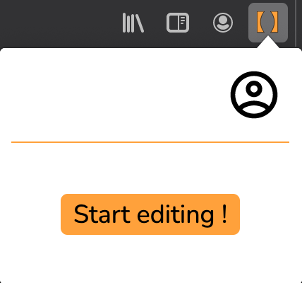
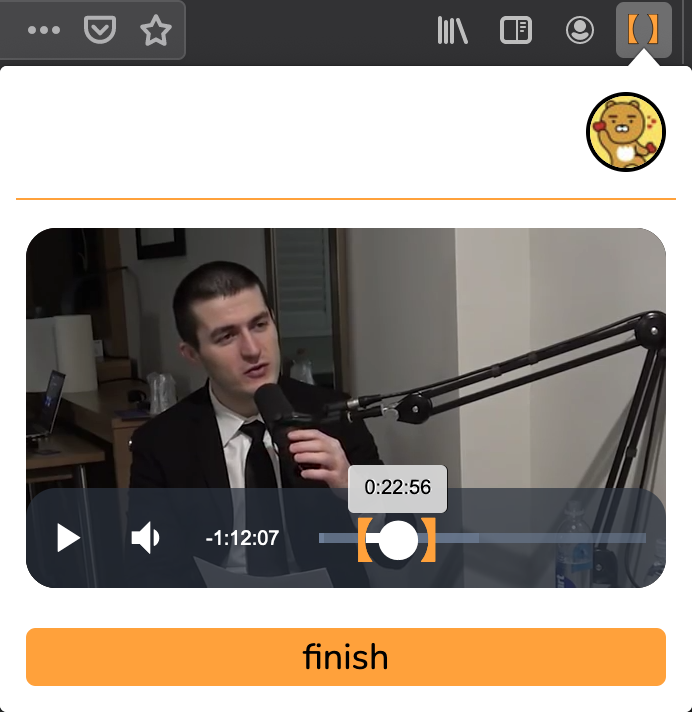
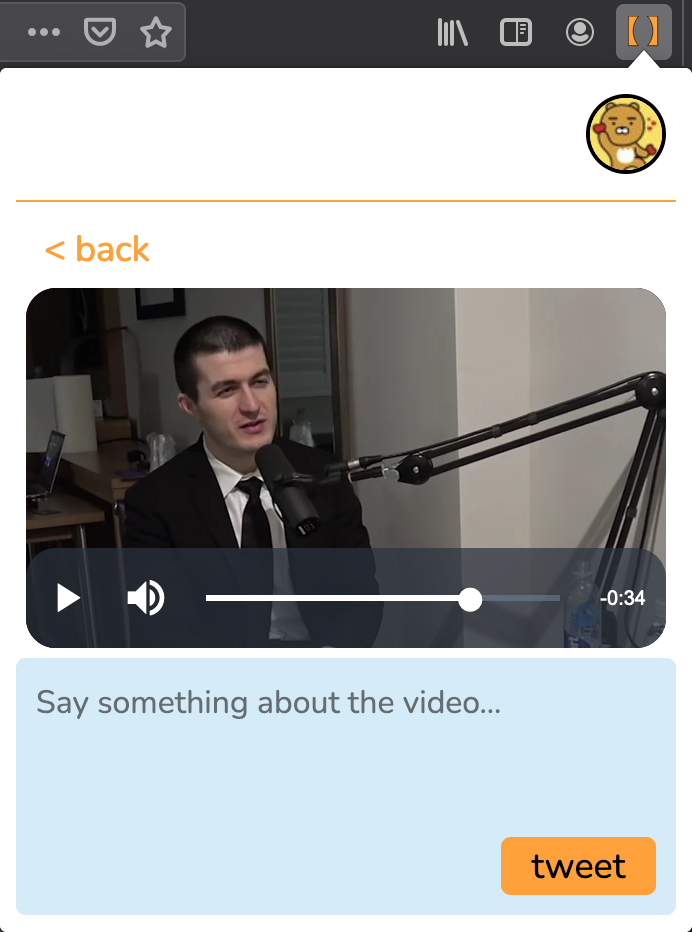
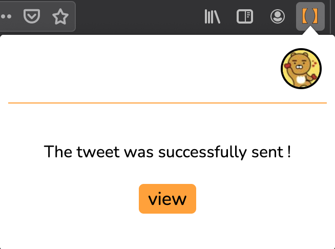

<table class="p-4 rounded-md drop-shadow-md dark:bg-blue-900 bg-blue-100">
  <thead>
    <tr>
      <th class="px-4">Type</th>
      <th>Duration</th>
      <th>Programming Language</th>
      <th>Libraries</th>
      <th>Concepts</th>
    </tr>
  </thead>
  <tbody>
    <tr>
      <td class="p-4">Browser extension</td>
      <td>Feb, 2021 - June, 2021</td>
      <td>Javascript</td>
      <td>Lit-element, videojs, nodejs, AWS, dynamoDB</td>
      <td>Websockets, queues, oauth, video processing</td>
    </tr>
  </tbody>
</table>

Clipshare is the first project that I ever took from an idea to a production ready app. Pundits and news commentators
on Twitter often use short video clips to provide context for their tweets. A typical workflow for producing
these video clips will involve the following steps:

1. Download the source video to computer.
2. Clip the video to only include what is relevant for the commentary.
3. Post tweet with video clip.

Clipshare simplifies this process by allowing the user to reach the same goal without leaving the browser.

## Architecture

## What I got right

1. **Making a browser extension**. Creating a browser extension as my first app was motivated by the fact 
that browser extensions are naturally quite limited in terms of functionalities because of their small UI. 
I wanted to make sure that I would be able to complete the project within a reasonable amount of time and avoid any scope creep.
2. **An app that is an optimization**. Users are usually quite keen to find ways to do certain things faster.
I believe it's generally easier to onboard users to an app that provides an improvement on top of something
the user is already doing rather than try to sell the user on something new.
3. **The app user flow**. The app user flow is quite elegant and works well.

## What I got wrong

1. **Handling video data** : Video data is very expensive to manage in terms of storage and transfer costs.
There is also no economies of scale because the cost would increase linearly with the number of active users.
As a solo developer with little funding this was probably not a smart idea. There are some solutions to mitigate this.
For example by not downloading the video source to the backend and instead streaming it directly from Youtube to the frontend
I could have reduced storage and transfer costs.  
2. **Self hosting the backend** : With my background in systems engineering I wanted to build the cloud infrastructure
from scratch using AWS. This included setting up S3 buckets, dynamoDB tables, VPC, security groups, etc...
This was a poor choice for two reasons:
    -  **It takes time and it does not provide value for the customer**. The choice to self host was purely motivated 
    by an interest in building cloud infrastructure.
    - **It's more expensive**. The graph below shows the cost in dollars for hosting the infrastructure before the app was
    even released to the public. By June I started shutting down the infrastructure because it was not viable for me.

type: 'bar',
data: {
  labels: ['February', 'March', 'April', 'Mai', 'June', 'July'],
  datasets: [{
    label: 'AWS hosting cost',
    data: [9.26, 77.78, 70.64, 91.70, 65.13, 9.88],
  }]
}


3. **Not knowing who my customers are**: I didn't have a well defined target customers that I knew would find this app useful.
It was more of a hunch that I thought this is something people would find useful. Furthermore once the app was built I had no plan
on how to reach customers and let people know my app exists.
4. **Overengineering certain aspects**: Being able to distinguish between critical features and nice-to-have features is
very important if you want to be able to ship quickly. One feature which took me some time to implement and in hindsight
wasn't a critical one is the implementation of a cache mechanism which ensures that if the user leaves the app he could 
resume where he had left off when he came back to the app.
5. **Creating an "unfriendly" app from the point of vue of Youtube and Twitter**. Clipshare is both "youtube downloader" 
and "custom twitter client". Neither of these concepts are much appreciated by Youtube or Twitter.
This means that I'm playing a risky game where I could get cut off from the Twitter API or not get accepted on the Chrome
store. It is this observation which also led me to develop the app for Firefox only which meant cutting myself off 
from most of my potential customers.

## Takeaways

Even though I gave up on this project I was proud of what I had achieved on my own. I also got to make a lot of mistakes 
which is an important learning experience. Suprisingly, as I was working on my app Youtube was working on a similar feature 
called Youtube clips which was released on July 14, 2021. See the video presentation [here](https://www.youtube.com/watch?v=A63imEmP_-I)

## Screenshots

  
  
  
  

