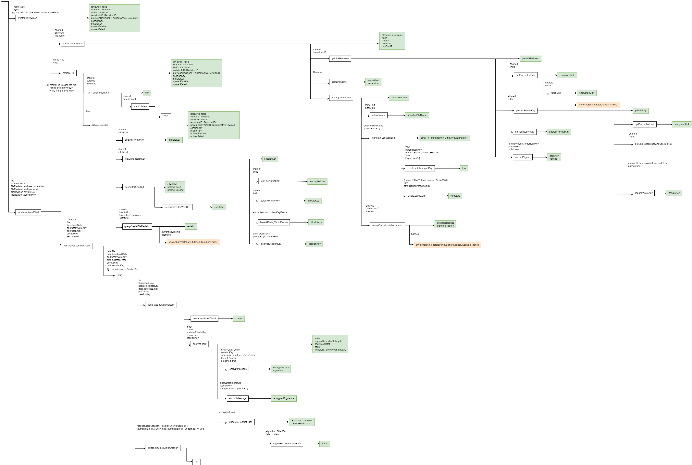
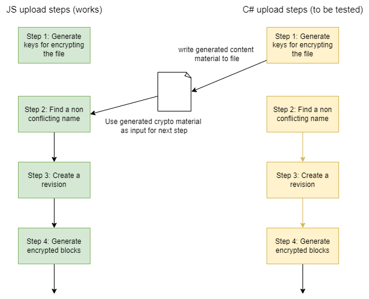

<table class="p-4 rounded-md drop-shadow-md dark:bg-blue-900 bg-blue-100">
  <thead>
    <tr>
      <th class="px-4">Type</th>
      <th>Duration</th>
      <th>Programming Language</th>
      <th>Concepts</th>
    </tr>
  </thead>
  <tbody>
    <tr>
      <td class="p-4">plugin</td>
      <td>Dec, 2022 - June 2023</td>
      <td>C#</td>
      <td>pgp, public/private cryptography</td>
    </tr>
  </tbody>
</table>

[ProtonDriveSync](https://github.com/dhaven/ProtonDriveSync) is an plugin for the password manager [KeePass](https://keepass.info/index.html). 
When using KeePass the user needs to decide where the encrypted file
that contains all of his passwords is going to be stored. Because most users want the file to be accessible on multiple devices,
a common pattern is to store the database in the Cloud. For example using Dropbox. Solutions like this compromise security
because they depend on the storage provider's privacy and security practices. As an alternative, [ProtonDrive](https://proton.me/drive) 
is an end-to-end encrypted storage solution. ProtonDriveSync is a plugin that let's you access database files stored on ProtonDrive.

ProtonDriveSync is available on the official list of plugins for KeePass: [link](https://keepass.info/plugins.html#pdsync)

The following sections describe my main takeaways from working on this project

## Architecture

ProtonDriveSync acts as a client for the ProtonDrive storage infrastructure. It is responsible for 3 main actions:
- **Authenticate** the user with his Proton account. This is done by implementing the SRP protocol. If the authentication is 
successful we receive an access token which can be used in the next steps.
- **Read** files from ProtonDrive. This is necessary so that the user can chose which database to open.
- **Write** files to ProtonDrive. This is necessary so that the user can save a modified database.

## Solving hard problems

By and large this was the hardest project I have ever been faced with. Here are some aspects I found
particularly difficult:

**Going from 0 to 1**: Building something new that hasn't been done before is going to be hard. There isn't any template you can
follow. No StackOverflow snippets to copy from and no framework to use as a baseline. Services built by the Proton team don't support 
third-party integrations. This means there is no public API. This can be explained by the nature of Proton's services
which are end-to-end encrypted and therefore need to ensure strong security standards. With third-party integrations you open
the door to new attacks and also potentially leaking user's data to third-parties. Building something that lacks any developer support is difficult. 
My approach to solving this was to dive into the Proton apps [source code](https://github.com/ProtonMail/WebClients) to understand the logic and then implement the same logic in my own app.

**Navigating large codebases**: You can very easily get lost when parsing large codebases. After going 20 levels deep in a call stack you 
might have forgotten what you were looking for. To make sure I didn’t get lost I relied on note taking. Describing in words what a certain file/function 
does and how it interacts with the rest of the app. I also created a visual map of the call stack as I read through the code.
This turned out to be invaluable because I could see at a glance the whole flow and from there summarize what are the main steps that 
I would need to implement in my app.

<figure class="image">
  
  <figcaption>Partial map of the call stack</figcaption>
</figure>

**Working with encryption**: Working with end-to-end encryption provided it's own set of challenges. A lot of logic is put on the client 
which is responsible for encrypting the data before 
it is sent to the servers. This encryption has a lot of moving parts with hierarchical encryption (X encrypts Y encrypts Z ...) 
which made it a hard puzzle to solve. It can also be difficult to verify that the code you wrote works as expected. In the 
case of encryption every execution will give you a different output and you can't simply "look" at the output value to see if it is correct.

## Being creative

A lot of the challenges laid out above required from me that I think outside the box in order to keep making progress. Here are 2 examples:
- **Writing parts of the logic in Javascript**. The Proton codebase I was using as reference point is written is Javascript. 
The application is was building had to be written in C#. Because what I was trying to implement was very complex I decided to first rewrite 
the flow in Javascript but stripping away as much of the complexity present in the source code. This way I could summarizing hundreds of lines of 
code spread across dozens of files in just a few lines of code. This accomplished a few things:
    - I had a reference code that I new to be correct. This meant that after writing the C# code I could "simply" compare the results with 
    the javascript code and validate that the code was working.
    - It makes it easier to understand what is going on and get a clear view of the steps involved in the process.
    - It serves as a checkpoint. You should never spend a lot of time writing code without validating that it is correct.
- **Testing the encryption process**. The only way to really know that the encryption is working is by doing all of the encryption steps and 
uploading the file to ProtonDrive. Then if you go to the web app and it doesn’t display any error it 
is safe to say that the encryption is working. When writing the code in JS this wasn’t too much of an issue because I was using the official 
Proton source code as template and using the same libraries so I was fairly sure it would work. In C# this was much harder 
to guaranty because the libraries I was using worked in different ways. In order to still be able to test certain steps independently the solution 
I found was to write the output of a given step to a file and then in the JS code read that file and proceed with the following steps until the 
file was uploaded (see diagram below). Because I knew the JS code worked if there was all of a sudden an issue uploading the file I would immediately know the issue 
was coming from my C# code and I could start investigating and fixing the issue.

<figure class="image">
  
  <figcaption>Process for testing different steps of the encryption flow</figcaption>
</figure>