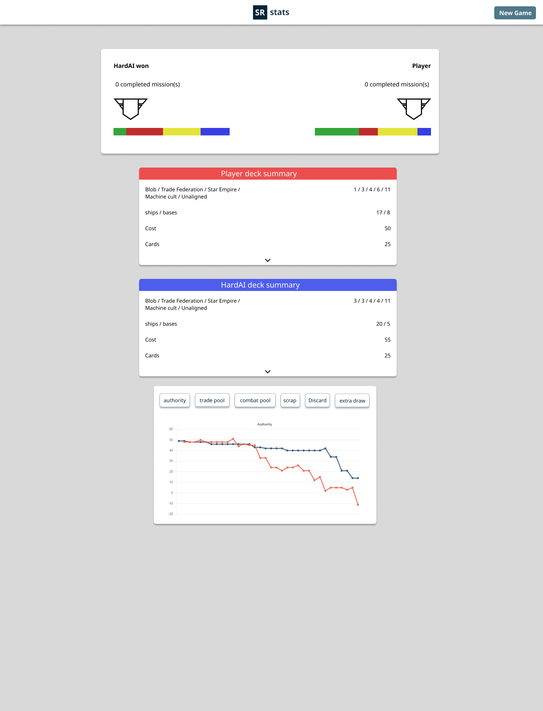
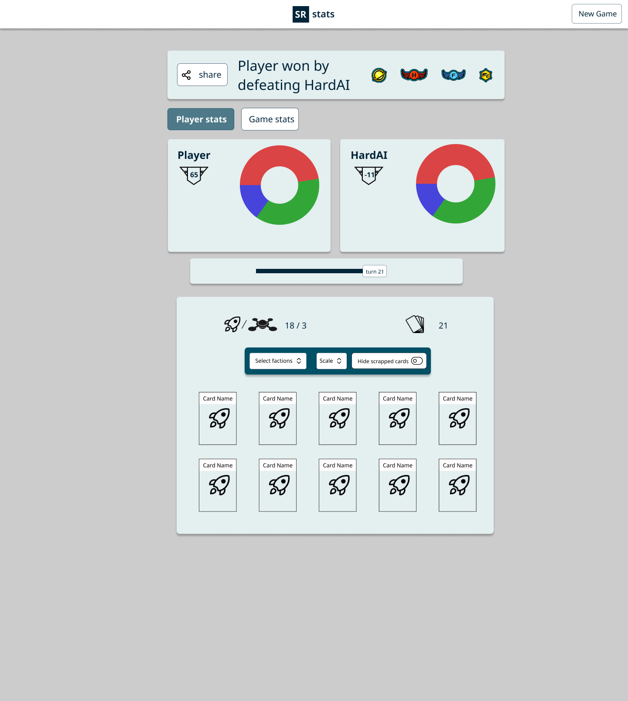
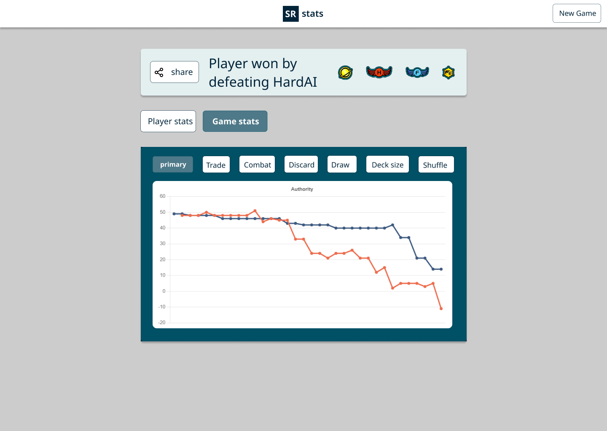
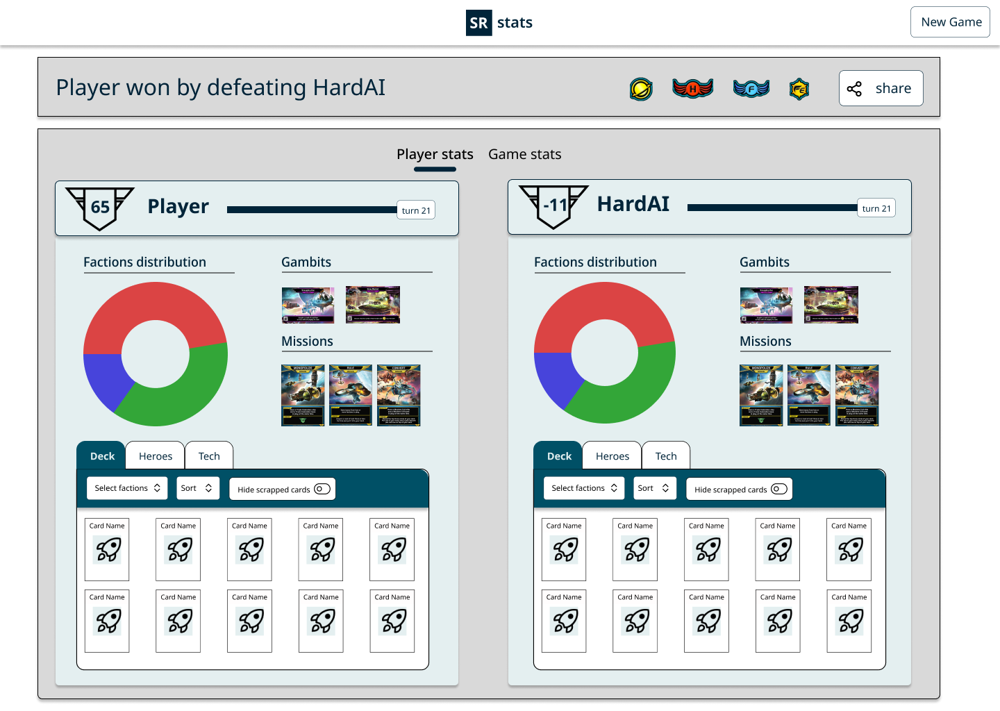
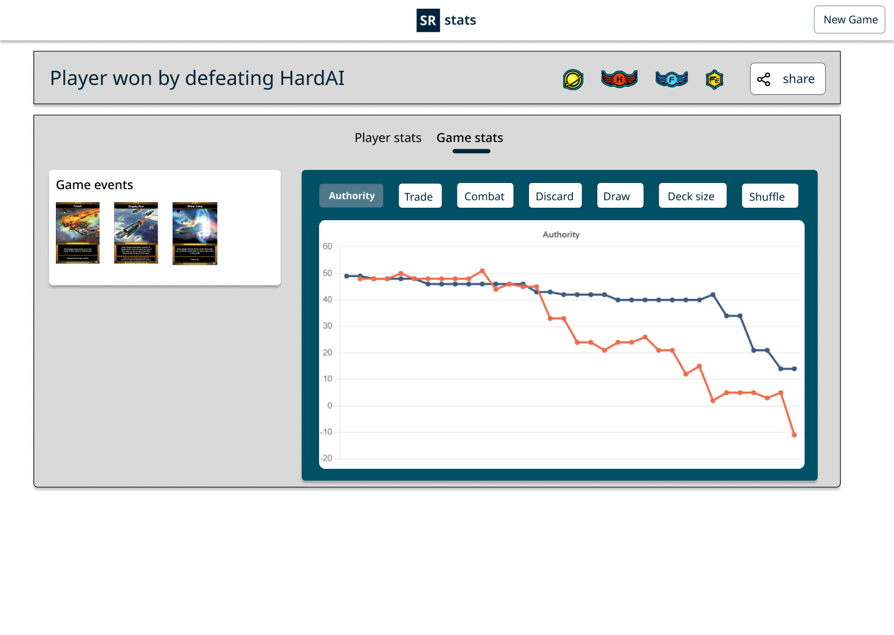

<table class="p-4 rounded-md drop-shadow-md dark:bg-blue-900 bg-blue-100">
  <thead>
    <tr>
      <th class="px-4">Type</th>
      <th>Duration</th>
      <th>Programming Language</th>
      <th>Libraries</th>
      <th>Concepts</th>
    </tr>
  </thead>
  <tbody>
    <tr>
      <td class="p-4">Web app</td>
      <td>Feb, 2022 - Now</td>
      <td>Javascript</td>
      <td>NextJS, Antlr4, MongoDB, graph.js, TailwindCSS</td>
      <td>Tree parsing, grammar </td>
    </tr>
  </tbody>
</table>

[Star Realms](https://www.starrealms.com/) is a fast-paced 2 player card game in which you construct a fleet of dangerous interstellar ships that you
use to inflict damage on your opponent and reduce his life to 0 before he does the same to you. It's available on Steam
and as a mobile app.
The Star Realms app doesn't provide any statistics once you have finished a game nor does it provide a history
of the game you've played.
[SR-stats](https://sr-stats.app/) attempts to fill this gap by providing a web app where players can upload games they have played and
view detailed statistics.

**Video presentation**


## Architecture
Once the user has finished a game of Star Realms he needs to copy the game data from the options menu and paste it
into the SR-stats app. Currently this is the only way to transfer a game between the 2 apps. 
SR-stats is as simple web app built using NextJS (a React framework). The main role of the backend is to
parse the input file, generate an AST and traverse the tree in order to end up with a json representation of the game which is
then stored on the MongoDB Cloud.

## What I got right

Thanks to the mistakes I made in my previous project [Clipshare](../clipshare/#what-i-got-wrong). This time around
I managed to get more things right.

1. **Focus on core features and have a POC out quickly**. Within 4 months of starting the development of this app I had 
something to show to the community. It only had a small set of features but it worked and it gave me the 
opportunity to collect feedback from the users and validate that this is something worth building.
2. **Keep it simple and cheap**: Only spend time on things that add value to the users and don't try to future
proof anything. I used the NextJS framework to build my ReactJS app and used Vercel to handle automatic deployment from
my Github repo. This saved me a lot of time.
3. **Build for well-known customers**. I knew who I was building this for and how to reach them (Facebook group, subreddit,
Discord servers). This meant I had to spend minimal effort on the marketing side of things.

## Tradeoffs I had to make

1. **The friction that comes from asking the users to upload each game manually**. In general I think it is ok to not aim
to have a solution that encapsulates the whole market. Rather the way I approach it is to first build for a niche of passionate
people and then grow the user base by making the app attractive to more people.
2. **Relying too much on a third-party**. Building something that is too tightly connected to an existing app of service is
a risk because you could easily be cut off. The advantage on the other hand is that you can piggyback off of an existing audience.

These are tradeoffs I was aware of when I started working on the project and I decided to proceed regardless because
I thought value could still be delivered.

## Takeaways

So far this has been a great learning experience. From the technical side I got to work with ASTs and grammars and spend time building
the UI and UX. I found the UI and UX design particularly challenging given my lack of experience in this domain. I am nonetheless
happy with how the app looks which is the result of multiple UI iterations.

From a human level, putting something I built in front of users, listening to feedback and building a community around the app 
were all things I was new at and I found them very rewarding. 

## Screenshots

Here are some figma designs of the different iterations the desktop UI went through.

### V1

### V2

  
  

### V3

  
  

